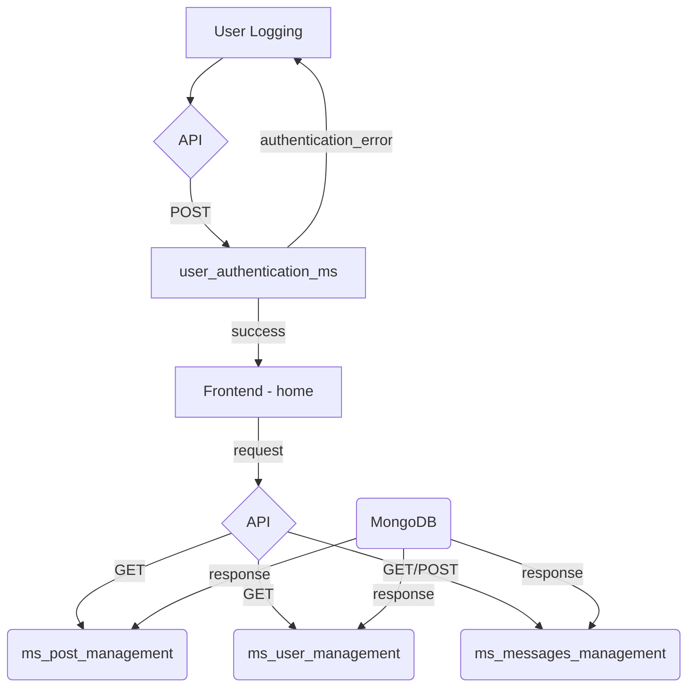
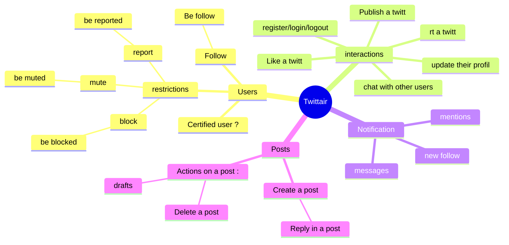

# What is 'Twittair' ? : 

❇️ Twittair is a small one that I had the idea to set up to keep me busy during my free time and improve my development knowledge.

Technically the application is developed in JavaScript (ReactJS) and Python (Flask + Django Rest Framework), the database used is a NoSQL mongodb database.

The goal was to create an application strongly inspired by Twitter, to add and / or remove features that 'I' find useless, it's my project I do what I want :p

The application is developed from scratch, I do this in my spare time so updates can take a long time to arrive.
## How does Twittair Microservices architecture work ? 

## Project Roadmap

Every item on the roadmap is an issue, with a label that indicates each of the following:

Infrastructure : 

- ✔️ | microservices architecture implementation

- ❌️ | Database Cloud implementation

Software : 

- ✔️ | Register & Login Service

- ✔️ | Post Feed Service

- ✔️ | React Base structure

- ❌️ | React Routes

- ❌️ | Make a post

- ❌️ | User profile

- ❌️ | User can configure the app

